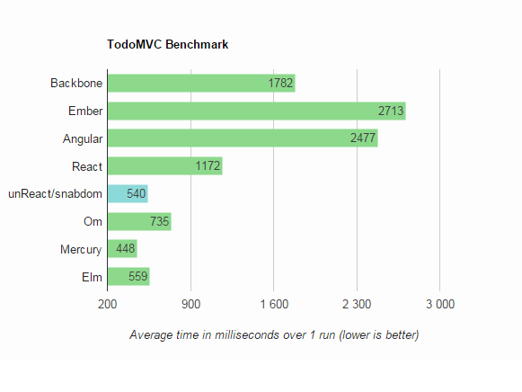

# TodoMVC Performance Comparison

todomvc performance comparison for [snabbdom](https://github.com/paldepind/snabbdom) and [unReact](https://github.com/yelouafi/unReact) based app

sample results from running this in Chrome 43/Windows 7 on a HP elitebook (CPU core duo 2,13 Ghz, 3 Go RAM) 

This was principally for testing of requestAnimationFrame debouncing optimization on the application performance (.i.e. instead of rendering on each state change, schedules a render on requestAnimationFrame, so we can save same precious browser render cycles. unReact is ineherently ineffecien as it has to recalculate the state one each render operation.

[][runner]

[runner]: http://evancz.github.io/todomvc-perf-comparison/
